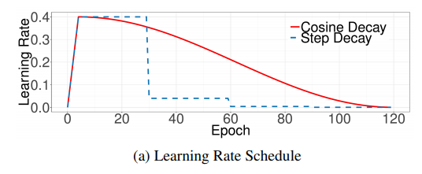
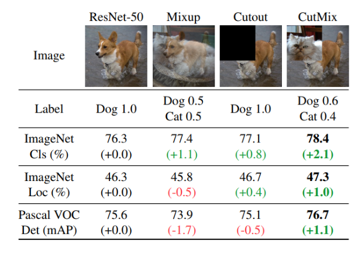
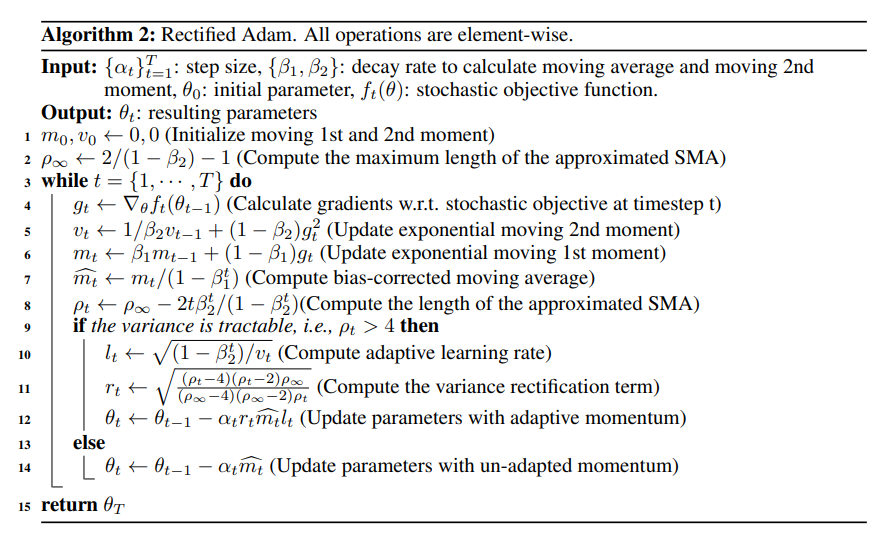
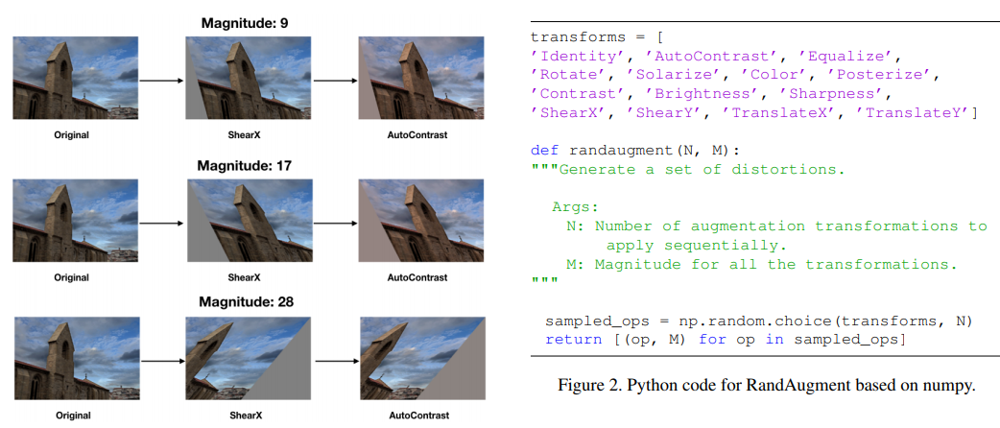
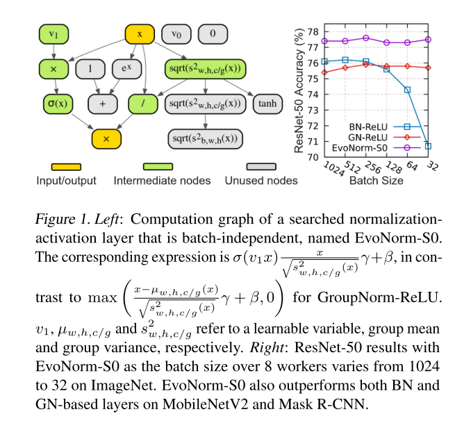
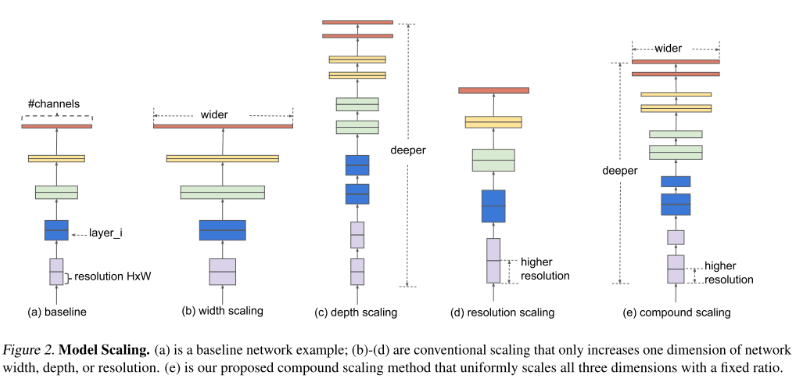

# carrier-of-tricks-for-classification-pytorch
carrier of tricks for image classification tutorials using pytorch. Based on ["Bag of Tricks for Image Classification with Convolutional Neural Networks", 2019 CVPR Paper](http://openaccess.thecvf.com/content_CVPR_2019/papers/He_Bag_of_Tricks_for_Image_Classification_with_Convolutional_Neural_Networks_CVPR_2019_paper.pdf), implement classification codebase using custom dataset.

- author: hoya012  
- last update: 2020.06.25
- [supplementary materials (blog post written in Korean)](https://hoya012.github.io/blog/Bag-of-Tricks-for-Image-Classification-with-Convolutional-Neural-Networks-Review/)

## 0. Experimental Setup (I used 1 GTX 1080 Ti GPU!)
### 0-1. Prepare Library

```python
pip install -r requirements.txt
```

### 0-2. Download dataset (Kaggle Intel Image Classification)

- [Intel Image Classification](https://www.kaggle.com/puneet6060/intel-image-classification/)

This Data contains around 25k images of size 150x150 distributed under 6 categories.
{'buildings' -> 0,
'forest' -> 1,
'glacier' -> 2,
'mountain' -> 3,
'sea' -> 4,
'street' -> 5 }

### 0-3. Download ImageNet-Pretrained Weights (EfficientNet, RegNet)
- [facebook_research_pycls](https://github.com/facebookresearch/pycls/blob/master/MODEL_ZOO.md)
- download **RegNetY-1.6GF** and **EfficientNet-B2** weights

### 1. Baseline Training Setting
- ImageNet Pratrained ResNet-50 from torchvision.models
- 1080 Ti 1 GPU / Batch Size 64 / Epochs 120 / Initial Learning Rate 0.1
- Training Augmentation: Resize((256, 256)), RandomCrop(224, 224), RandomHorizontalFlip(), RandomVerticalFlip(), Normalize(mean=[0.485, 0.456, 0.406],std=[0.229, 0.224, 0.225])
- SGD + Momentum(0.9) + learning rate step decay (x0.1 at 30, 60, 90 epoch)

```python
python main.py --checkpoint_name baseline;
```

#### 1-1. Simple Trials
- Random Initialized ResNet-50 (from scratch)
- Adam Optimizer with small learning rate

### 2. Bag of Tricks from Original Papers
#### 2-1. Learning Rate Warmup 
- first 5 epochs to warmup

#### 2-2. Zero gamma in Batch Normalization
- zero-initialize the last BN in each residual branch

#### 2-3. Cosine Learning Rate Annealing


#### 2-4. Label Smoothing

- In paper, use smoothing coefficient as 0.1. I will use same value.
- The number of classes in imagenet (1000) is different from the number of classes in our dataset (6), but i didn't tune them.

#### 2-5. MixUp Augmentation
- [MixUp paper link](https://arxiv.org/pdf/1710.09412.pdf)

- lambda is a random number drawn from Beta(alpha, alpha) distribution.
- I will use alpha=0.2 like paper.

### 3. Additional Tricks from hoya012's survey note
#### 3-1. CutMix Augmentation
- [CutMix paper link](https://arxiv.org/pdf/1905.04899.pdf)

- I will use same hyper-parameter (cutmix alpha=1.0, cutmix prob=1.0) with ImageNet-Experimental Setting

#### 3-2. RAdam Optimizer
- [RAdam Optimizer paper link](https://arxiv.org/pdf/1908.03265.pdf)


#### 3-3. RandAugment
- [RandAugment paper link](https://arxiv.org/pdf/1909.13719.pdf)


#### 3-4. EvoNorm
- [EvoNorm paper link](https://arxiv.org/pdf/2004.02967.pdf)
- [EvoNorm paper review post(Korean Only)](https://hoya012.github.io/blog/evonorm/)



#### 3-5. Other Architecture (EfficientNet, RegNet)
- [EfficientNet paper link](https://arxiv.org/pdf/1905.11946.pdf)
- [EfficientNet paper review post(Korean Only)](https://hoya012.github.io/blog/EfficientNet-review/)
- [RegNet paper link](https://arxiv.org/pdf/2003.13678.pdf)




- I will use EfficientNet-B2 which has similar acts with ResNet-50
    - But, because of GPU Memory, i will use small batch size (48)...
- I will use RegNetY-1.6GF which has similar FLOPS and acts with ResNet-50

### 4. Performance Table
- B : Baseline
- A : Adam Optimizer
- W : Warm up 
- Z : Zero Gamma in Batch Norm
- C : Cosine Annealing
- S : Label Smoothing
- M : MixUp Augmentation

- CM: CutMix Augmentation
- R : RAdam Optimizer
- RA : RandAugment
- E : EvoNorm 

- EN : EfficientNet
- RN : RegNet

|   Algorithm  |    Train Accuracy   | Validation Accuracy | Test Accuracy |
|:------------:|:-------------------:|:-------------------:|:-------------:|
|B from scratch|         62.81       |        81.08        |        -      |
|       B      |         65.31       |        82.44        |        -      |
|     B + W    |         76.00       |        91.13        |        -      |
|     B + Z    |         73.41       |        89.49        |      88.83    |
|   B + W + Z  |         74.71       |        90.06        |      90.30    |
|     B + A    |         82.01       |        92.80        |        -      |
|   B + A + W  |         81.89       |        93.05        |      92.87    |
| B + A + W + C|         85.07       |        92.70        |      93.03    |
| B + A + W + S|         82.79       |        93.34        |        -      |
| B + A + W + M|          -          |          -          |        -      |
|B + A + W + S + M|       -          |          -          |        -      |
|B + A + W + C + S|      85.28       |        93.30        |        -      |
|B + A + W + C + M|       -          |          -          |        -      |
|B + A + W + C + S + M|   -          |          -          |        -      |
|:------------:|:-------------------:|:-------------------:|:-------------:|
|  BAWC + CM   |         69.97       |        92.98        |      93.57    |
|  BWCS + R    |         85.42       |        92.83        |      93.53    |
|  BAWCS + RA  |         71.94       |        92.87        |      92.67    |
|  BAWCS + E   |         85.24       |        93.12        |      92.97    |
| BWC + CM + R |         xx.xx       |        xx.xx        |      xx.xx    |
|:------------:|:-------------------:|:-------------------:|:-------------:|
|  EN + AWCS   |         xx.xx       |        xx.xx        |      xx.xx    |
|  EN + AWCSM  |         xx.xx       |        xx.xx        |      xx.xx    |
|EN + AWC + CM |         xx.xx       |        xx.xx        |      xx.xx    |
|EN + WCS + R  |         xx.xx       |        xx.xx        |      xx.xx    |
|EN + WC + CM + R|       xx.xx       |        xx.xx        |      xx.xx    |
|:------------:|:-------------------:|:-------------------:|:-------------:|
|  RN + AWCS   |         xx.xx       |        xx.xx        |      xx.xx    |
|  RN + AWCSM  |         xx.xx       |        xx.xx        |      xx.xx    |
|RN + AWC + CM |         xx.xx       |        xx.xx        |      xx.xx    |
|RN + WCS + R  |         xx.xx       |        xx.xx        |      xx.xx    |
|RN + WC + CM + R|       xx.xx       |        xx.xx        |      xx.xx    |
|:------------:|:-------------------:|:-------------------:|:-------------:|


## Code Reference
- Gradual Warmup Scheduler: https://github.com/ildoonet/pytorch-gradual-warmup-lr
- Label Smoothing: https://github.com/NVIDIA/DeepLearningExamples/blob/master/PyTorch/Classification/ConvNets/image_classification/smoothing.py
- MixUp Augmentation: https://github.com/NVIDIA/DeepLearningExamples/blob/master/PyTorch/Classification/ConvNets/image_classification/mixup.py
- CutMix Augmentation:https://github.com/clovaai/CutMix-PyTorch
- RAdam Optimizer: https://github.com/LiyuanLucasLiu/RAdam
- RandAugment: https://github.com/ildoonet/pytorch-randaugment
- EvoNorm: https://github.com/digantamisra98/EvoNorm
- ImageNet-Pretrained EfficientNet, RegNet: https://github.com/facebookresearch/pycls
